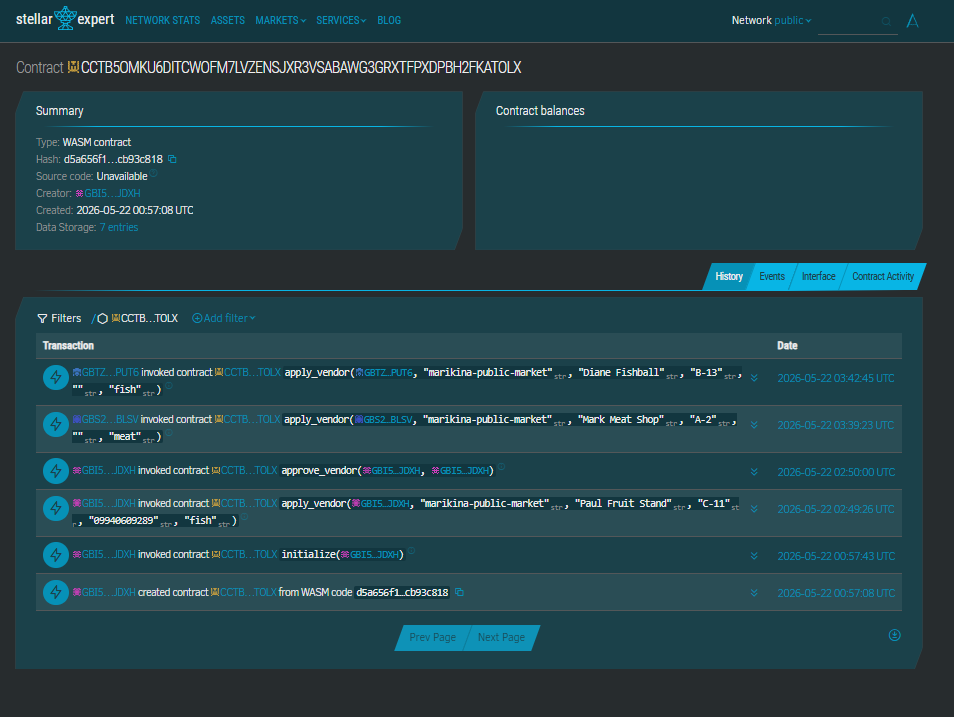
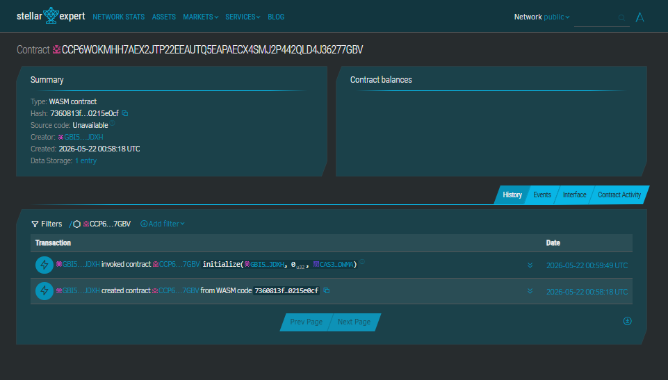
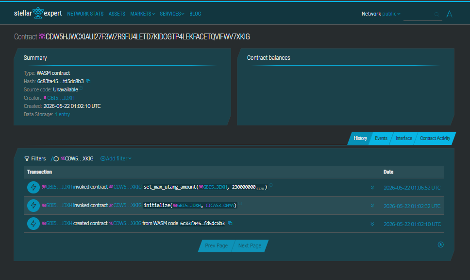

<div align="center">


# PalengkePay

> Stellar-powered micropayment PWA for Philippine wet market vendors. No bank account required.


**Live:** [Testnet →](https://palengkepay-pro.vercel.app) · [Mainnet →](https://palengkepay-mainnet.vercel.app)
**Demo:** [Testnet walkthrough →](https://youtu.be/hOiuXBG5A3Q?si=lLhgmeAsGQVen8e1) · Mainnet walkthrough _pending_
**Docs:** [📖 Full Detail README →](FULL_DETAIL_README.md)

</div>

---

## 🧩 Problem
The Philippine wet market economy runs almost entirely on cash, locking vendors and customers out of formal finance.
- ~37.6M Filipinos unbanked (World Bank Findex 2025) — only 50.2% of adults own a financial account
- 45% of self-employed Filipinos unbanked (BSP 2021); track utang on paper or by memory
- 99.63% of registered PH businesses are MSMEs (DTI 2024) — most palengke vendors earn ₱1,000–₱4,999/day
- Vendors can't prove income for loans/aid; customers get no receipts and no structured repayment

## 🌟 Vision
A Philippines where every wet market vendor has a verifiable on-chain financial identity — provable income, transparent credit history, and cashless payments without a bank — built on open Stellar rails accessible to anyone with a phone.

## 🎯 Purpose
Built to break the cash-only exclusion cycle: give micro-entrepreneurs cryptographic proof of revenue, give customers tamper-proof receipts, and put utang (BNPL) on-chain so neither party loses track. Mission is financial inclusion, not crypto speculation.

## 👥 Target Users
PH wet market participants and micro-merchants outside the formal banking system.
- **Palengke Vendors** — fish/meat/produce stall owners selling daily, no bank account, want to track income and offer installment credit
- **Palengke Customers** — daily shoppers paying small amounts, want digital receipts and a clean way to manage utang
- **Market Administrators** — manage vendor onboarding, approvals, and dashboards per palengke

## ✨ Features
- **Gasless QR Payments** — vendor shows QR, customer scans and pays XLM in seconds; sponsor wallet absorbs all network fees via Stellar `FeeBumpTransaction`
- **PHP-First Stable Checkout** — customer enters PHP, app locks a short-lived PHP/XLM quote, dual-currency receipt after confirm
- **On-Chain Utang (BNPL)** — Soroban escrow with installments, 7-day grace, 1% reserve pool, 5% late-fee resume, on-chain default reputation
- **On-Chain Vendor Reputation** — 1–5 star ratings per payment, stored via `VendorRegistry.submit_rating`; one rating per `(vendor, tx_hash)`
- **Vendor Income Proof Pack** — per-period bank-ready certificate, CSV/JSON/text exports, wallet-signed Testnet attestation
- **SEP-24 Fiat Anchor + Cash-In / Cash-Out** — full SEP-1/10/24 anchor; PHP↔XLM via PDAX-mocked client with operator manual settlement console at `/admin/ramps`
- **Web Push Notifications** — VAPID-backed push for payments, utang accepted/paid/completed, due-soon/overdue reminders (daily cron)
- **Live Vendor Open/Closed Status** — toggle stored as Stellar account data entry, sponsored reserves keep it gasless
- **Public Shareable Receipts** — `/receipt/:txHash` read-only, Web Share API, OG previews, direct Stellar Expert link
- **Multi-Wallet + PWA** — Freighter / xBull / Albedo (desktop), LOBSTR via WalletConnect (mobile); installable on Android/iOS, no app store
- **EN / TL Toggle + PHP/XLM Display Switch + Hide-Balance Privacy Mode**

## 🛠️ Tech Stack
- **Frontend:** React 19 + Vite 8 + TypeScript + Tailwind CSS v4
- **Backend:** Vercel serverless functions (Node) — fee-bump, SEP-10 auth, SEP-24 dispatcher, push fan-out, ramp store, health
- **Blockchain:** Stellar (Soroban smart contracts in Rust `soroban-sdk` 22.x, Horizon API, Stellar SDK, SEP-1/10/24)
- **Other tools:** `@creit.tech/stellar-wallets-kit`, `qrcode.react`, `html5-qrcode`, `vite-plugin-pwa` + Workbox, `web-push` + VAPID, Upstash Redis (Vercel Marketplace), `@sentry/react`, CoinGecko price API, PDAX HMAC SHA-384 client (mock mode)

## 🚀 How to Run Locally

### Prerequisites
- **Node.js** 20+
- **Rust** + `wasm32v1-none` target — `rustup target add wasm32v1-none`
- **[stellar-cli](https://github.com/stellar/stellar-cli)** 25.2+
- **Wallet** — [Freighter](https://www.freighter.app/) (desktop browser extension) or [LOBSTR](https://lobstr.co/) (mobile, via WalletConnect)

### 1. Clone + install
```bash
git clone https://github.com/polsalarm/PalengkePay
cd PalengkePay/frontend
npm ci --legacy-peer-deps
```
Windows PowerShell: if a transitive wallet package postinstall fails with `yarn setup || true`, run `npm ci --legacy-peer-deps --ignore-scripts`.

### 2. Configure env
```bash
cp .env.example .env.local
```
Fill in `frontend/.env.local`:
```env
# Network — Testnet (default)
VITE_STELLAR_NETWORK=testnet
VITE_SOROBAN_RPC_URL=https://soroban-testnet.stellar.org
VITE_VENDOR_REGISTRY_CONTRACT_ID=CDEQVKKRIXJHQRZCMOKE65LL2LMDXOY3MHKXQ2AP2DNHP56NPIT2NLJR
VITE_PALENGKE_PAYMENT_CONTRACT_ID=CDSCCIT7L5ZNY5AYHOA2T6HMDEXFR7ZVR6JEWHJXXQCSILOMDOEKW5WY
VITE_UTANG_ESCROW_CONTRACT_ID=CCPYLRKBCM4SSQYNEETXDWANEQ3Q7AB7SBS254L3CHTEGQADTX5IOI53
VITE_UTANG_FEE_XLM=1

# Mainnet (swap on the mainnet Vercel project)
# VITE_STELLAR_NETWORK=mainnet
# VITE_SOROBAN_RPC_URL=https://mainnet.sorobanrpc.com
# VITE_VENDOR_REGISTRY_CONTRACT_ID=CCTB5OMKU6DITCWOFM7LVZENSJXR3VSABAWG3GRXTFPXDPBH2FKATOLX
# VITE_PALENGKE_PAYMENT_CONTRACT_ID=CCP6WOKMHH7AEX2JTP22EEAUTQ5EAPAECX4SMJ2P442QLD4J36277GBV
# VITE_UTANG_ESCROW_CONTRACT_ID=CDW5HJWCXIAUI27F3WZRSFU4LETD7KIDOGTP4LEKFACETQVIFWV7XKIG

# Fee sponsorship (server-only — never ship to client)
SPONSOR_SECRET=SA...
FEE_BUMP_ALLOWED_DESTINATIONS=G...,G...
FEE_BUMP_RATE_LIMIT_WINDOW_MS=60000
FEE_BUMP_RATE_LIMIT_MAX=20

# Upstash Redis (auto-injected by Vercel Marketplace; optional locally)
KV_REST_API_URL=
KV_REST_API_TOKEN=

# Web Push (VAPID) — generate via `npx web-push generate-vapid-keys`
VITE_VAPID_PUBLIC_KEY=
VAPID_PRIVATE_KEY=
VAPID_SUBJECT=mailto:you@example.com

# SEP-24 anchor (generate keypair via `stellar keys generate <name>`, fund via Friendbot)
ANCHOR_SIGNING_SECRET=S...
ANCHOR_HOME_DOMAIN=palengkepay-pro.vercel.app
ANCHOR_BASE_URL=https://palengkepay-pro.vercel.app
ANCHOR_NETWORK_PASSPHRASE=Test SDF Network ; September 2015
ANCHOR_HORIZON_URL=https://horizon-testnet.stellar.org

# PDAX fiat rails (mock for hackathon, real keys for live)
PDAX_MOCK=true
PDAX_API_KEY=
PDAX_API_SECRET=
PDAX_BASE_URL=https://api.pdax.ph
RAMP_RATE_FALLBACK=7.85

# Ramp admin operator key (random hex; pasted into /admin/ramps)
RAMP_ADMIN_KEY=
```
See [`FULL_DETAIL_README.md`](FULL_DETAIL_README.md#environment-variables) for the full env reference + every server-only sponsor variable.

### 3. Run frontend
```bash
npm run dev
```
Open `http://localhost:5173`.

### 4. Build / test contracts
```bash
cd contracts
cargo test --workspace        # 33 contract tests
stellar contract build        # WASM for deployment
```

### 5. Quality gates
```bash
cd frontend
npx tsc --noEmit
npm test
npm run lint
npm run build
npm run qa:visual             # Playwright across desktop + mobile, writes to qa-artifacts/
```

### 6. Mobile testing
- Install LOBSTR (Android Play Store / iOS App Store), save recovery phrase
- Get testnet XLM via in-app onboarding Step 3 (auto-funds) or [Friendbot](https://friendbot.stellar.org/)
- Open the dev URL in your phone, tap **Connect Wallet → WalletConnect → Open in LOBSTR** (deep link, no QR scan needed)
- Install as PWA: Android Chrome ⋮ → *Add to Home screen*; iOS Safari Share → *Add to Home Screen*

## 🧪 Testnet Deployment

| Contract | Address | Explorer |
|----------|---------|----------|
| VendorRegistry | `CDEQVKKRIXJHQRZCMOKE65LL2LMDXOY3MHKXQ2AP2DNHP56NPIT2NLJR` | [Stellar Expert →](https://stellar.expert/explorer/testnet/contract/CDEQVKKRIXJHQRZCMOKE65LL2LMDXOY3MHKXQ2AP2DNHP56NPIT2NLJR) |
| PalengkePayment | `CDSCCIT7L5ZNY5AYHOA2T6HMDEXFR7ZVR6JEWHJXXQCSILOMDOEKW5WY` | [Stellar Expert →](https://stellar.expert/explorer/testnet/contract/CDSCCIT7L5ZNY5AYHOA2T6HMDEXFR7ZVR6JEWHJXXQCSILOMDOEKW5WY) |
| UTangEscrow | `CCPYLRKBCM4SSQYNEETXDWANEQ3Q7AB7SBS254L3CHTEGQADTX5IOI53` | [Stellar Expert →](https://stellar.expert/explorer/testnet/contract/CCPYLRKBCM4SSQYNEETXDWANEQ3Q7AB7SBS254L3CHTEGQADTX5IOI53) |

📸 Screenshots — Stellar Expert (Testnet):


Network: Stellar Testnet (`Test SDF Network ; September 2015`). Resets ~quarterly — redeploy + update `.env.local` after each reset.

## 🚀 Mainnet Deployment

Deployed 2026-05-22.

| Contract | Address | Explorer |
|----------|---------|----------|
| VendorRegistry | `CCTB5OMKU6DITCWOFM7LVZENSJXR3VSABAWG3GRXTFPXDPBH2FKATOLX` | [Stellar Expert →](https://stellar.expert/explorer/public/contract/CCTB5OMKU6DITCWOFM7LVZENSJXR3VSABAWG3GRXTFPXDPBH2FKATOLX) |
| PalengkePayment | `CCP6WOKMHH7AEX2JTP22EEAUTQ5EAPAECX4SMJ2P442QLD4J36277GBV` | [Stellar Expert →](https://stellar.expert/explorer/public/contract/CCP6WOKMHH7AEX2JTP22EEAUTQ5EAPAECX4SMJ2P442QLD4J36277GBV) |
| UTangEscrow | `CDW5HJWCXIAUI27F3WZRSFU4LETD7KIDOGTP4LEKFACETQVIFWV7XKIG` | [Stellar Expert →](https://stellar.expert/explorer/public/contract/CDW5HJWCXIAUI27F3WZRSFU4LETD7KIDOGTP4LEKFACETQVIFWV7XKIG) |

📸 Screenshots — Stellar Expert (Mainnet):





- **Admin:** `GBI5W3JPFNGBMW2TCSGTNL3NPW6E423UN4BMAXAU34AXTSMTSDT2JDXH`
- **Native XLM SAC:** `CAS3J7GYLGXMF6TDJBBYYSE3HQ6BBSMLNUQ34T6TZMYMW2EVH34XOWMA`
- **UTangEscrow BNPL cap:** 230 000 000 stroops (≈ ₱500)
- Cash-in / cash-out (PDAX) stays testnet-only — mainnet ramps blocked on PDAX CAAS + KMS custody.

## 🎬 Demo

### 🔗 Live Apps
| Network | URL |
|---------|-----|
| Testnet | [palengkepay-pro.vercel.app](https://palengkepay-pro.vercel.app) |
| Mainnet | [palengkepay-mainnet.vercel.app](https://palengkepay-mainnet.vercel.app) |

### 🎥 Demo Videos
| Network | Video |
|---------|-------|
| Testnet — 60s intro | [YouTube Shorts →](https://www.youtube.com/shorts/WmEz41GHeng?feature=share) |
| Testnet — full MVP walkthrough | [YouTube →](https://youtu.be/hOiuXBG5A3Q?si=lLhgmeAsGQVen8e1) |
| Mainnet walkthrough | _pending_ |

- 📊 **User Feedback (Google Sheets):** [View responses →](https://docs.google.com/spreadsheets/d/1g0AYRCwqc1-zcxy2q5UnIGHtllJHsXSaUvTCD7POI-g/edit?usp=sharing)
- 🖼️ **Pitch Deck:** _coming soon_

## 👤 Team
| Name | Role | GitHub |
|------|------|--------|
| Paul Henry Dacalan | Project Lead / Lead Developer | [@polsalarm](https://github.com/polsalarm) |
| Lady Diane Casilang | UI/UX Developer | — |
| Mark Angelo Siazon | Researcher / Developer | — |

## 📄 License
MIT
