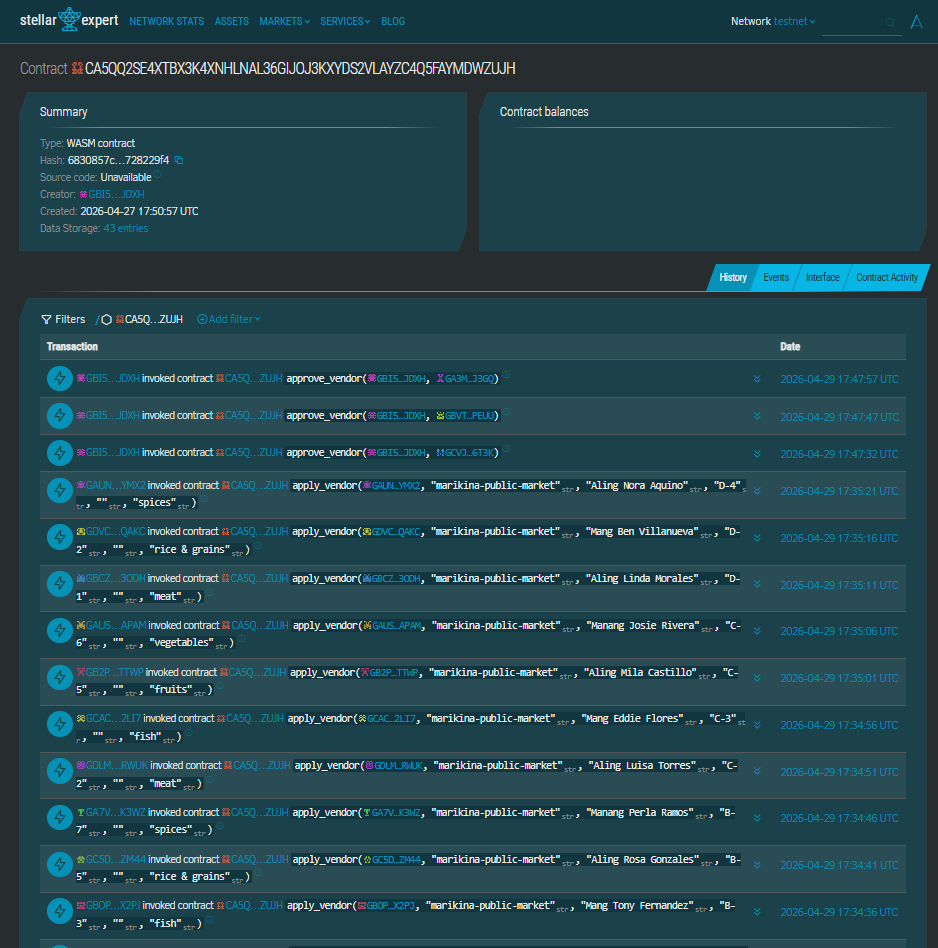
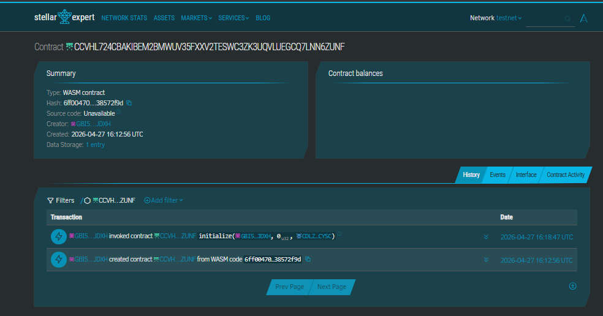
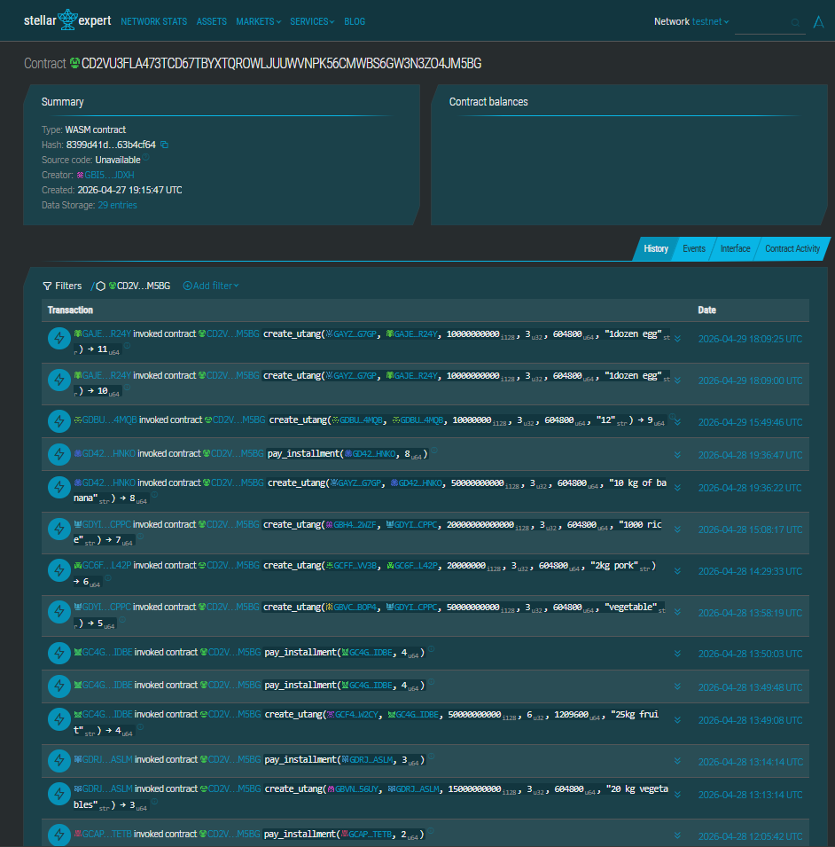

# PalengkePay — Smart Contracts

Three Soroban contracts on Stellar Testnet.

## Contracts

| Contract | Contract ID | Description |
|----------|-------------|-------------|
| `vendor-registry` | `CA5QQ2SE4XTBX3K4XNHLNAL36GIJOJ3KXYDS2VLAYZC4Q5FAYMDWZUJH` | On-chain vendor identity — register, apply, approve, deactivate, stats |
| `palengke-payment` | `CCVHL724CBAKIBEM2BMWUV35FXXV2TESWC3ZK3UQVLUEGCQ7LNN6ZUNF` | QR-based XLM payment settlement with fee support |
| `utang-escrow` | `CD2VU3FLA473TCD67TBYXTQROWLJUUWVNPK56CMWBS6GW3N3ZO4JM5BG` | BNPL installment agreements — create, pay, complete, default |

### VendorRegistry

`CA5QQ2SE4XTBX3K4XNHLNAL36GIJOJ3KXYDS2VLAYZC4Q5FAYMDWZUJH` · [View on Stellar Expert →](https://stellar.expert/explorer/testnet/contract/CA5QQ2SE4XTBX3K4XNHLNAL36GIJOJ3KXYDS2VLAYZC4Q5FAYMDWZUJH)



### PalengkePayment

`CCVHL724CBAKIBEM2BMWUV35FXXV2TESWC3ZK3UQVLUEGCQ7LNN6ZUNF` · [View on Stellar Expert →](https://stellar.expert/explorer/testnet/contract/CCVHL724CBAKIBEM2BMWUV35FXXV2TESWC3ZK3UQVLUEGCQ7LNN6ZUNF)



### UTangEscrow

`CD2VU3FLA473TCD67TBYXTQROWLJUUWVNPK56CMWBS6GW3N3ZO4JM5BG` · [View on Stellar Expert →](https://stellar.expert/explorer/testnet/contract/CD2VU3FLA473TCD67TBYXTQROWLJUUWVNPK56CMWBS6GW3N3ZO4JM5BG)



## Prerequisites

```bash
# Install Rust
curl --proto '=https' --tlsv1.2 -sSf https://sh.rustup.rs | sh

# Add wasm32 target
rustup target add wasm32v1-none

# Install Stellar CLI 25.2+
cargo install --locked stellar-cli --features opt
```

## Build

```bash
cd contracts
stellar contract build
```

Or per-contract:

```bash
cd contracts/vendor-registry   && cargo build --release --target wasm32v1-none
cd contracts/palengke-payment  && cargo build --release --target wasm32v1-none
cd contracts/utang-escrow      && cargo build --release --target wasm32v1-none
```

## Test

```bash
cd contracts
cargo test --workspace
```

Or per-contract:

```bash
cd contracts/vendor-registry   && cargo test
cd contracts/palengke-payment  && cargo test
cd contracts/utang-escrow      && cargo test
```

## Deploy to Testnet

```bash
# Fund a testnet account (once)
stellar keys generate admin --network testnet
stellar keys fund admin --network testnet

# 1 — Deploy & initialize VendorRegistry
stellar contract deploy \
  --wasm contracts/vendor-registry/target/wasm32v1-none/release/vendor_registry.wasm \
  --source admin \
  --network testnet

stellar contract invoke \
  --id <VENDOR_REGISTRY_CONTRACT_ID> \
  --source admin \
  --network testnet \
  -- initialize \
  --admin $(stellar keys address admin)

# 2 — Deploy & initialize PalengkePayment
stellar contract deploy \
  --wasm contracts/palengke-payment/target/wasm32v1-none/release/palengke_payment.wasm \
  --source admin \
  --network testnet

stellar contract invoke \
  --id <PALENGKE_PAYMENT_CONTRACT_ID> \
  --source admin \
  --network testnet \
  -- initialize \
  --admin $(stellar keys address admin) \
  --fee_bps 0 \
  --token $(stellar contract id asset --asset native --network testnet)

# 3 — Deploy & initialize UTangEscrow
stellar contract deploy \
  --wasm contracts/utang-escrow/target/wasm32v1-none/release/utang_escrow.wasm \
  --source admin \
  --network testnet

stellar contract invoke \
  --id <UTANG_ESCROW_CONTRACT_ID> \
  --source admin \
  --network testnet \
  -- initialize \
  --admin $(stellar keys address admin) \
  --token $(stellar contract id asset --asset native --network testnet)
```

## After Deploy

Add contract IDs to `frontend/.env.local`:

```env
VITE_STELLAR_NETWORK=testnet
VITE_SOROBAN_RPC_URL=https://soroban-testnet.stellar.org
VITE_VENDOR_REGISTRY_CONTRACT_ID=<VENDOR_REGISTRY_CONTRACT_ID>
VITE_PALENGKE_PAYMENT_CONTRACT_ID=<PALENGKE_PAYMENT_CONTRACT_ID>
VITE_UTANG_ESCROW_CONTRACT_ID=<UTANG_ESCROW_CONTRACT_ID>
VITE_UTANG_FEE_XLM=1
```

## Generate TypeScript Bindings (optional)

```bash
stellar contract bindings typescript \
  --network testnet \
  --id <VENDOR_REGISTRY_CONTRACT_ID> \
  --output-dir frontend/src/lib/bindings/vendor-registry

stellar contract bindings typescript \
  --network testnet \
  --id <PALENGKE_PAYMENT_CONTRACT_ID> \
  --output-dir frontend/src/lib/bindings/palengke-payment

stellar contract bindings typescript \
  --network testnet \
  --id <UTANG_ESCROW_CONTRACT_ID> \
  --output-dir frontend/src/lib/bindings/utang-escrow
```
