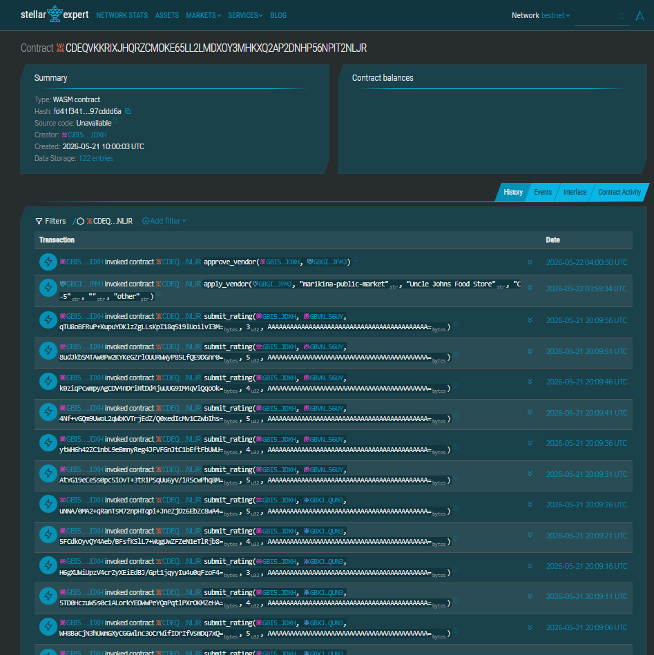
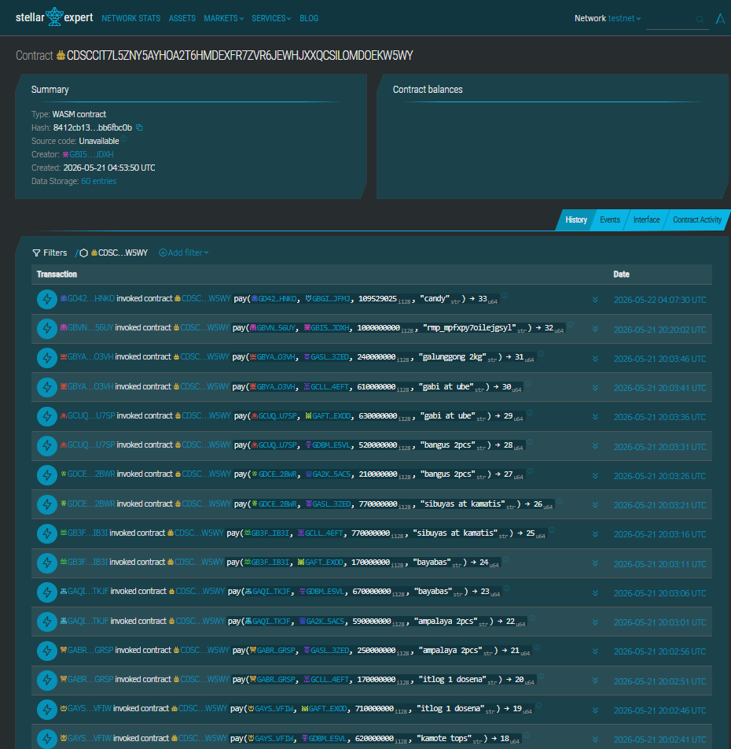
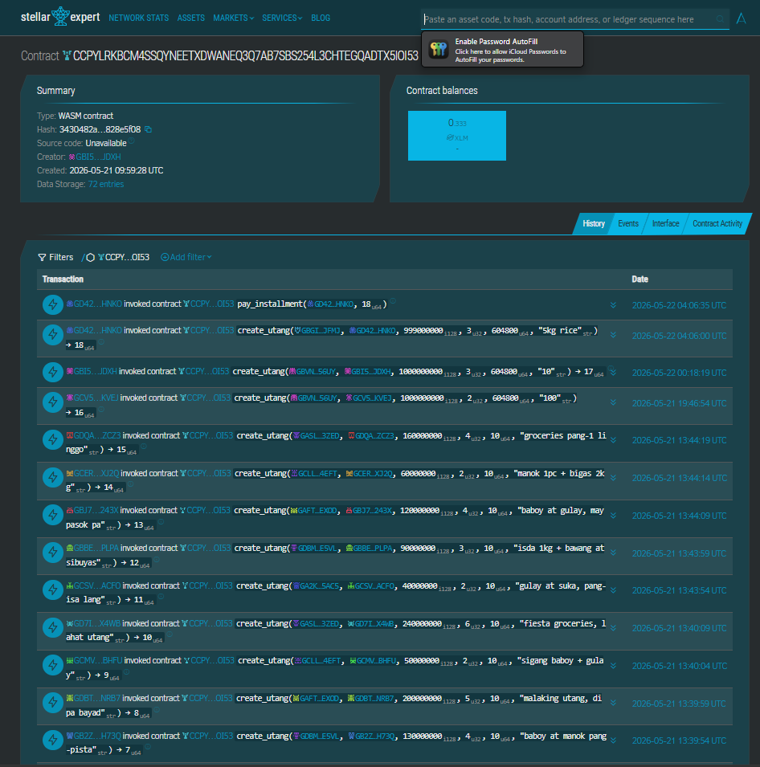

# PalengkePay — Smart Contracts

Three Soroban contracts deployed to **Stellar Mainnet (2026-05-22)** and **Stellar Testnet**,
plus a fourth (`credit-pool`) built for the **Credit RWA layer** (see below, deploy pending).

---

## Credit RWA Layer (hackathon pivot, 2026-06-20) — deployed to testnet

Reframes PalengkePay for **Track 1 (Local Finance & RWA)**: a vendor's on-chain cashflow
history becomes a verifiable credit profile that underwrites score-gated working capital.

### `VendorRegistry::get_credit_score(vendor) -> u32`

FICO-style **300–850** score, deterministic and side-effect free. Derived purely from
state the registry already stores — no new writes, no new admin surface:

| Factor | Source | Contribution |
|--------|--------|-------------:|
| Cashflow volume | `total_volume` (XLM stroops, tiered ≥1/10/50/100 XLM) | up to +200 |
| Activity | `total_transactions` (tiered ≥1/10/50/100/500) | up to +150 |
| Reputation | `RatingSum`/`RatingCount` avg stars (×100) | up to +200 |
| Defaults | `VendorDefaultsReceived` × −100 each | penalty, floored at 300 |

Unknown / inactive vendor → 300 floor (no panic). Covered by 5 unit tests (registry suite 32/32).

### `credit-pool` — score-gated USDC lending pool

A USDC liquidity pool that lends working capital to vendors, with each draw gated by the
vendor's `get_credit_score` (read cross-contract). This is the composability primitive.

| Fn | Auth | Behavior |
|----|------|----------|
| `initialize(admin, token, registry)` | admin | sets USDC SAC + VendorRegistry oracle, MIN_SCORE 500 |
| `deposit(lp, amount)` | lp | LP funds pool liquidity (USDC into contract custody) |
| `draw(vendor, amount)` | vendor | borrow, gated by `available_to`; records debt; emits score |
| `repay(vendor, amount)` | vendor | repay principal; overpay clamped to outstanding debt |
| `set_schedule(vendor, interval_seconds, amount_per_period)` | vendor | opt in to scheduled auto-repay cadence |
| `cancel_schedule(vendor)` | vendor | opt out; kill-switch (also revoke the token allowance separately) |
| `collect(vendor)` | **permissionless** | pulls `min(amount_per_period, debt)` via SEP-41 `transfer_from` against the vendor's standing token allowance; gated on-chain by `next_due` so it can't be called early to drain the whole allowance at once |
| `credit_limit(vendor)` | view | `(score − MIN_SCORE) × 1 USDC`; 0 below floor |
| `available_to(vendor)` | view | `min(credit_limit − debt, pool_balance)` |
| `debt` / `pool_balance` / `min_score` / `registry` / `token` / `schedule` | view | getters |
| `set_min_score(admin, n)` | admin | tune qualification floor |

`CREDIT_PER_POINT = 10_000_000` (1 USDC, 7-decimal) per point above MIN_SCORE 500 →
score 850 = 350 USDC ceiling. Auto-repay requires the vendor to separately
`token.approve(vendor, pool, cap, expiration_ledger)` — `collect` never moves more than
that standing allowance permits. Covered by 16 unit tests (mock registry + real SAC),
wasm ~7 KB.

### Deployed (testnet, 2026-06-20)

The previously deployed testnet `vendor-registry` (`CDEQVKKR…`) lacked an `upgrade`
entrypoint, so a **fresh** VendorRegistry was deployed (current source — has both
`upgrade` + `get_credit_score`). Two `credit-pool` instances share the same registry as
their credit oracle: one settles in **USDC**, one in native **XLM** (vendors pick their
rail). Admin/oracle is the `palengkepay` identity.

| Component | Testnet Contract ID |
|-----------|---------------------|
| `vendor-registry` (v2, with credit score) | `CDDDOUWUWGHSBEJDFK5ACA6CQH235UQ252VBPGX7O74G3EYUZZEBYKJR` |
| `credit-pool` (USDC) | `CCJ63ODUQXWRGWGKOOSPQQRHZJYZWGAZ2RK5J4G2T6RNVSLEFR4P5IAQ` |
| `credit-pool` (XLM) | `CAVS2MUDEJSMTJKKCTMHINHHT7OKXSLWMEHSQMCZT5E6MFX4VKZ45AO4` |
| `USDC` SAC (issuer = `palengkepay`) | `CDY4LM3FP2R7FBITPY6RW7HJDKOLZICDVVMAQVQYMH3DOYKC3VEWIXCZ` |
| native XLM SAC | `CDLZFC3SYJYDZT7K67VZ75HPJVIEUVNIXF47ZG2FB2RMQQVU2HHGCYSC` |

**Verified end-to-end on-chain:** seeded a vendor to score 520 (100 XLM volume + 2 txns) →
`credit_limit` 20 XLM → funded XLM pool 100 XLM → vendor drew 20 XLM → `debt` 20, pool
balance 80. The fresh registry has no migrated history; demo vendors are re-seeded.

> **Note:** the v2 registry is a separate contract from the app's existing
> `VITE_VENDOR_REGISTRY_CONTRACT_ID` (`CDEQVKKR…`). Wire the credit-layer UI to the v2 IDs
> via new env vars; do not repoint the existing registry/payment/escrow without re-seeding.

---

## Credit Score Oracle Fix (testnet, upgraded 2026-07-24)

Closed a hackathon-judge REJECT: a single admin key could hand-type
`increment_stats`/`report_default` calls to fabricate any vendor's score
inputs — no multisig, no decentralized oracle. Full writeup, design
rationale, and the CLI/SDK gotchas hit deploying this are in
`CREDIT_SCORE_ORACLE_FIX.md` at the repo root. **Same contract ID as
above** (`CDDDOUWU…`) — upgraded in place, not redeployed.

| Change | Detail |
|--------|--------|
| Pull-based scoring | New permissionless fns `record_activity_from_payment(payment_id)` / `record_activity_from_installment(utang_id)` / `record_default_from_utang(utang_id)` — read the already-settled `Payment`/`Utang` record straight off the live `palengke-payment`/`utang-escrow` contracts and credit vendor stats, deduped by ID. No signature required; correctness comes from reading real settlement data. |
| New admin-gated setters | `set_payment_contract(signers, contract)` / `set_escrow_contract(signers, contract)` — point the registry at the real payment/escrow contract IDs. Currently set to `CDSCCIT7…`/`CCPYLRKB…` (the live ones). |
| 2-of-3 multisig | New `migrate_to_multisig(admin, signers, threshold)` (one-time bootstrap) + `require_multisig` helper now gate `set_payment_contract`, `set_escrow_contract`, `increment_stats`, `report_default`, `set_signers`, and **`upgrade` itself**. `increment_stats`/`report_default` are kept as a manual-override/dispute path only — not the routine path anymore. |
| Live committee | 3 dedicated new testnet keys (local CLI identities `vr-signer-1`/`vr-signer-2`/`vr-signer-3`), threshold 2. **Losing 2 of 3 permanently locks the contract out of every gated fn above** — the permissionless `record_activity_from_*`/`record_default_from_*` paths are unaffected. |

New wasm hash: `19f137a72d6d53bb2277f7c6e4cb725404327b5773b0b744a89f55445c4a0fde`.
49/49 unit tests green. **Verified end-to-end on real testnet** — both the
permissionless pull path (real `pay()` → `record_activity_from_payment` →
`get_vendor`/`get_credit_score` moved) and the multisig path (all 12
negative cases across the 4 gated fns rejected on-chain; positive 2-of-3
signed calls succeeded for `increment_stats`, `report_default`, and a
no-op self-`upgrade`).

---

## Mainnet Deploy (2026-05-22)

First mainnet deployment includes all default-handling + Phase 0 contract hardening
(`set_token`, `set_max_utang_amount`, `upgrade` admin escape hatches). Settlement
token is native XLM; BNPL principal capped at 230,000,000 stroops (≈₱500 at 22 PHP/XLM).

| Contract | Mainnet Contract ID |
|----------|---------------------|
| `vendor-registry` | `CCTB5OMKU6DITCWOFM7LVZENSJXR3VSABAWG3GRXTFPXDPBH2FKATOLX` |
| `palengke-payment` | `CCP6WOKMHH7AEX2JTP22EEAUTQ5EAPAECX4SMJ2P442QLD4J36277GBV` |
| `utang-escrow` | `CDW5HJWCXIAUI27F3WZRSFU4LETD7KIDOGTP4LEKFACETQVIFWV7XKIG` |

Admin keypair (mainnet + testnet, same `stellar keys` identity `palengkepay`):
`GBI5W3JPFNGBMW2TCSGTNL3NPW6E423UN4BMAXAU34AXTSMTSDT2JDXH`

Native XLM SAC on mainnet: `CAS3J7GYLGXMF6TDJBBYYSE3HQ6BBSMLNUQ34T6TZMYMW2EVH34XOWMA`

### Deployed Mainnet WASM (optimized)

| WASM | Bytes | SHA-256 |
|------|------:|---------|
| `vendor_registry.optimized.wasm` | 13 892 | `d5a656f1cee86ccbb94729638f158711680e29611f1a4171115e0dd2cb93c818` |
| `palengke_payment.optimized.wasm` | 5 751 | `7360813fbb625d0a1566053dc9deb8c3bbdfc1272b5e46ac1f129aef0215e0cf` |
| `utang_escrow.optimized.wasm` | 15 356 | `6c83fa459352917c32ba2877a4f2e9c887ff866ec10b4a68c968d0aefd5dc8b3` |

Deploy cost: ~43 XLM. All 3 contracts can be upgraded via admin `upgrade(new_wasm_hash)` —
no redeploy, state preserved.

[VendorRegistry](https://stellar.expert/explorer/public/contract/CCTB5OMKU6DITCWOFM7LVZENSJXR3VSABAWG3GRXTFPXDPBH2FKATOLX) ·
[PalengkePayment](https://stellar.expert/explorer/public/contract/CCP6WOKMHH7AEX2JTP22EEAUTQ5EAPAECX4SMJ2P442QLD4J36277GBV) ·
[UTangEscrow](https://stellar.expert/explorer/public/contract/CDW5HJWCXIAUI27F3WZRSFU4LETD7KIDOGTP4LEKFACETQVIFWV7XKIG)

---

## Default-Handling Upgrade (testnet, deployed 2026-05-21)

Second redeploy on 2026-05-21 added utang default management — grace period,
reserve pool, late-fee resume, and per-vendor / per-customer default counters.
Old contract IDs are superseded; old testnet data not migrated.

| Contract | New behavior |
|----------|--------------|
| `utang-escrow` | `mark_default` now requires `now > next_due + grace_period` (default 7d, admin-configurable via `set_grace_period`). 1% of each `pay_installment` skimmed to per-utang reserve held in contract custody — paid to vendor on default, refunded to customer on completion. New `resume_after_late(customer, utang_id)` charges 5% of `installment_amount` to vendor and flips status `Defaulted → Active`. New views: `customer_defaults(addr)`, `vendor_defaults(addr)`, `utang_reserve(id)`, `is_overdue(id)`, `grace_period()`. New events: `UtangDefaultedEvent`, `UtangResumedEvent`. |
| `vendor-registry` | New admin-only `report_default(vendor, customer)` mirrors aggregate counts for reputation. New views: `vendor_defaults_received(addr)`, `customer_defaults_history(addr)`. New event: `DefaultReportedEvent`. |
| `palengke-payment` | Unchanged from PR #3. Hash refreshed by rebuild only. |

### Auth Hardening (PR #3, still live)

| Contract | Hardening |
|----------|-----------|
| `vendor-registry` | `apply_vendor` requires `wallet.require_auth()`; `increment_stats` requires positive amount + (as of 2026-07-24) 2-of-3 multisig, not admin alone — see Credit Score Oracle Fix above; `report_default` same multisig gate |
| `utang-escrow` | `create_utang` requires `customer.require_auth()`; `mark_default` requires admin auth + grace elapsed; `resume_after_late` requires debtor auth; `set_grace_period` requires admin auth |
| `palengke-payment` | adds `CustomerPayments` index + `get_customer_payments(customer, limit, offset)` |

### Deployed WASM (2026-05-21 — default-handling upgrade)

| WASM | Bytes | SHA-256 |
|------|------:|---------|
| `palengke_payment.wasm` | 6 682 | `adde555dad17b6553c96b878d08220e813969ea82bf65a25c06c96965833a25e` |
| `vendor_registry.wasm`  | 16 736 | `fd41f3419056fba7ece4136c6597f0ca4b7ac10991e9b9b616c5e4f797cddd6a` |
| `utang_escrow.wasm`     | 16 164 | `3430482a8e8e6a6d74283852cf0f6b05c172b8a7798b26c972f1344d828e5f08` |

Admin keypair: `GBI5W3JPFNGBMW2TCSGTNL3NPW6E423UN4BMAXAU34AXTSMTSDT2JDXH`
(== `stellar keys address palengkepay`). Native XLM SAC bound to utang-escrow:
`CDLZFC3SYJYDZT7K67VZ75HPJVIEUVNIXF47ZG2FB2RMQQVU2HHGCYSC`.

## Contracts

| Contract | Contract ID | Description |
|----------|-------------|-------------|
| `vendor-registry` | `CDEQVKKRIXJHQRZCMOKE65LL2LMDXOY3MHKXQ2AP2DNHP56NPIT2NLJR` | On-chain vendor identity — register, apply, approve, deactivate, stats, ratings, default reputation |
| `palengke-payment` | `CDSCCIT7L5ZNY5AYHOA2T6HMDEXFR7ZVR6JEWHJXXQCSILOMDOEKW5WY` | QR-based XLM payment settlement with fee support |
| `utang-escrow` | `CCPYLRKBCM4SSQYNEETXDWANEQ3Q7AB7SBS254L3CHTEGQADTX5IOI53` | BNPL installments — create, pay, default with grace + reserve, resume after late fee |
| `credit-pool` (USDC) | `CCJ63ODUQXWRGWGKOOSPQQRHZJYZWGAZ2RK5J4G2T6RNVSLEFR4P5IAQ` | Score-gated USDC working-capital pool reading `get_credit_score`, incl. scheduled auto-repay (see Credit RWA Layer) |
| `credit-pool` (XLM) | `CAVS2MUDEJSMTJKKCTMHINHHT7OKXSLWMEHSQMCZT5E6MFX4VKZ45AO4` | Same pool, settles in native XLM |

### VendorRegistry

`CDEQVKKRIXJHQRZCMOKE65LL2LMDXOY3MHKXQ2AP2DNHP56NPIT2NLJR` · [View on Stellar Expert →](https://stellar.expert/explorer/testnet/contract/CDEQVKKRIXJHQRZCMOKE65LL2LMDXOY3MHKXQ2AP2DNHP56NPIT2NLJR)



### PalengkePayment

`CDSCCIT7L5ZNY5AYHOA2T6HMDEXFR7ZVR6JEWHJXXQCSILOMDOEKW5WY` · [View on Stellar Expert →](https://stellar.expert/explorer/testnet/contract/CDSCCIT7L5ZNY5AYHOA2T6HMDEXFR7ZVR6JEWHJXXQCSILOMDOEKW5WY)



### UTangEscrow

`CCPYLRKBCM4SSQYNEETXDWANEQ3Q7AB7SBS254L3CHTEGQADTX5IOI53` · [View on Stellar Expert →](https://stellar.expert/explorer/testnet/contract/CCPYLRKBCM4SSQYNEETXDWANEQ3Q7AB7SBS254L3CHTEGQADTX5IOI53)



## Prerequisites

```bash
# Install Rust
curl --proto '=https' --tlsv1.2 -sSf https://sh.rustup.rs | sh

# Add wasm32 target
rustup target add wasm32v1-none

# Install Stellar CLI 25.2+
cargo install --locked stellar-cli --features opt
```

## Build

```bash
cd contracts
stellar contract build
```

Or per-contract:

```bash
cd contracts/vendor-registry   && cargo build --release --target wasm32v1-none
cd contracts/palengke-payment  && cargo build --release --target wasm32v1-none
cd contracts/utang-escrow      && cargo build --release --target wasm32v1-none
```

## Test

```bash
cd contracts
cargo test --workspace
```

Or per-contract:

```bash
cd contracts/vendor-registry   && cargo test
cd contracts/palengke-payment  && cargo test
cd contracts/utang-escrow      && cargo test
```

## Deploy to Testnet

```bash
# Fund a testnet account (once)
stellar keys generate admin --network testnet
stellar keys fund admin --network testnet

# 1 — Deploy & initialize VendorRegistry
stellar contract deploy \
  --wasm contracts/vendor-registry/target/wasm32v1-none/release/vendor_registry.wasm \
  --source admin \
  --network testnet

stellar contract invoke \
  --id <VENDOR_REGISTRY_CONTRACT_ID> \
  --source admin \
  --network testnet \
  -- initialize \
  --admin $(stellar keys address admin)

# 2 — Deploy & initialize PalengkePayment
stellar contract deploy \
  --wasm contracts/palengke-payment/target/wasm32v1-none/release/palengke_payment.wasm \
  --source admin \
  --network testnet

stellar contract invoke \
  --id <PALENGKE_PAYMENT_CONTRACT_ID> \
  --source admin \
  --network testnet \
  -- initialize \
  --admin $(stellar keys address admin) \
  --fee_bps 0 \
  --token $(stellar contract id asset --asset native --network testnet)

# 3 — Deploy & initialize UTangEscrow
stellar contract deploy \
  --wasm contracts/utang-escrow/target/wasm32v1-none/release/utang_escrow.wasm \
  --source admin \
  --network testnet

stellar contract invoke \
  --id <UTANG_ESCROW_CONTRACT_ID> \
  --source admin \
  --network testnet \
  -- initialize \
  --admin $(stellar keys address admin) \
  --token $(stellar contract id asset --asset native --network testnet)
```

## Redeploy Only PalengkePayment

Use this when the payment contract source changes but the registry and utang contracts can stay as-is.

```powershell
cd "C:\Codes Local\Hackathons (Workspace)\05-13-26 - PalengkePay\Stellar-PalengkePay-Pro\contracts"

# Verify and build
& "$env:USERPROFILE\.cargo\bin\cargo.exe" test --workspace
& "$env:USERPROFILE\.cargo\bin\cargo.exe" build --release --target wasm32v1-none -p palengke-payment

# Deploy the new payment contract
$NEW_PAYMENT_ID = stellar contract deploy `
  --wasm .\target\wasm32v1-none\release\palengke_payment.wasm `
  --source admin `
  --network testnet

# Initialize with native XLM
$ADMIN_ADDRESS = stellar keys address admin
$NATIVE_TOKEN = stellar contract id asset --asset native --network testnet

stellar contract invoke `
  --id $NEW_PAYMENT_ID `
  --source admin `
  --network testnet `
  -- initialize `
  --admin $ADMIN_ADDRESS `
  --fee_bps 0 `
  --native_token $NATIVE_TOKEN

# Smoke the new customer-history view method
stellar contract invoke `
  --id $NEW_PAYMENT_ID `
  --source admin `
  --network testnet `
  -- get_customer_payments `
  --customer $ADMIN_ADDRESS `
  --limit 1 `
  --offset 0
```

After redeploy, update `VITE_PALENGKE_PAYMENT_CONTRACT_ID` in `frontend/.env.local`, Vercel env vars, `README.md`, `contracts/README.md`, and `docs/CONTRACTS.md`.

## After Deploy

Add contract IDs to `frontend/.env.local`:

```env
VITE_STELLAR_NETWORK=testnet
VITE_SOROBAN_RPC_URL=https://soroban-testnet.stellar.org
VITE_VENDOR_REGISTRY_CONTRACT_ID=<VENDOR_REGISTRY_CONTRACT_ID>
VITE_PALENGKE_PAYMENT_CONTRACT_ID=<PALENGKE_PAYMENT_CONTRACT_ID>
VITE_UTANG_ESCROW_CONTRACT_ID=<UTANG_ESCROW_CONTRACT_ID>
VITE_UTANG_FEE_XLM=0.1
```

## Generate TypeScript Bindings (optional)

```bash
stellar contract bindings typescript \
  --network testnet \
  --id <VENDOR_REGISTRY_CONTRACT_ID> \
  --output-dir frontend/src/lib/bindings/vendor-registry

stellar contract bindings typescript \
  --network testnet \
  --id <PALENGKE_PAYMENT_CONTRACT_ID> \
  --output-dir frontend/src/lib/bindings/palengke-payment

stellar contract bindings typescript \
  --network testnet \
  --id <UTANG_ESCROW_CONTRACT_ID> \
  --output-dir frontend/src/lib/bindings/utang-escrow
```
